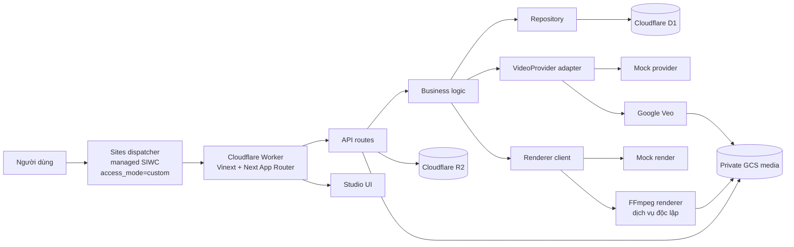
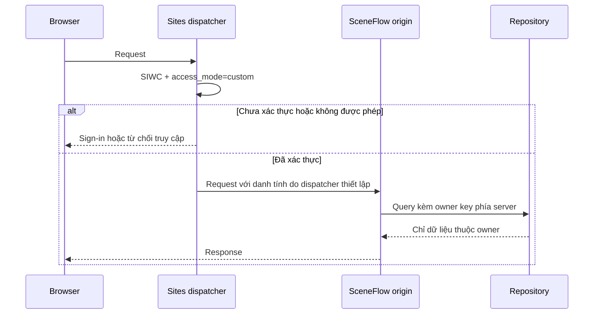

# ARCHITECTURE.md — Kiến trúc SceneFlow AI Studio

> Tài liệu này mô tả kiến trúc hiện tại trong Checkpoint 2.4C. Code/test local, production Sites 2.4A và renderer Cloud Run/GCS staging 2.4B đã hoàn tất; Veo Gate 1 và continuity hai cảnh Gate 2 đã PASS cả kỹ thuật lẫn owner manual QC. Trong Gate 3, cảnh 3 và preview cứu hộ cảnh 4 đã được owner approve; generation đã dừng trong hard cap. Artifact cứu hộ đã được upload private và final render bốn cảnh đã PASS kiểm tra kỹ thuật, quyền riêng tư và HTTP Range. Gate 3 còn chờ owner playback QC cuối; các SIWC interaction checks cũng chưa hoàn tất.

## 1. Mục tiêu kiến trúc

SceneFlow biến một brief thành video dài qua pipeline có kiểm soát:

```text
Brief → Story Bible → Storyboard → Tạo từng cảnh → QC → Ghép video
```

Kiến trúc phải giữ bốn invariant nghiệp vụ:

- Nhân vật, sản phẩm, bối cảnh và phong cách nhất quán giữa các cảnh.
- Đích sản phẩm cho phép mỗi cảnh dài 4, 6 hoặc 8 giây; storyboard MVP hiện lập cảnh 8 giây.
- Cảnh sau chỉ được tạo khi cảnh trước đã vượt QC.
- Frame cuối của cảnh trước là điểm neo continuity cho cảnh kế tiếp.

Output production là video 1080p đã ghép hoàn chỉnh. Studio hiện vẫn dùng mock để kiểm tra workflow, còn renderer staging đã ghép MP4 mẫu thật trên Cloud Run/GCS mà chưa gọi Veo.

## 2. Sơ đồ hệ thống



Các đường nối không có nghĩa mọi dịch vụ đã nối vào production. Cloud Run/GCS renderer staging đã canary PASS trong 2.4B; một cảnh Veo 3.1 Fast thật đã PASS Gate 1, Gate 2 đã PASS extraction frame → image-to-video cảnh kế tiếp → owner manual QC, và Gate 3 đã lặp lại continuity cho cảnh 3–4. Cảnh 3 và preview cứu hộ cảnh 4 đã được owner approve; artifact cứu hộ hiện là private GCS source chính thức của staging final render. Final render 32 giây đã PASS technical/private/range checks nhưng còn chờ owner playback QC. Worker-to-renderer wiring và production-scale queue/observability vẫn thuộc roadmap.

## 3. Trust boundary và Sign in with ChatGPT

### 3.1. Boundary được chọn

Sites dispatcher là cổng public được quản lý và là thành phần **sở hữu SIWC**. Deployment dùng `access_mode=custom`. Ứng dụng SceneFlow không tự triển khai một OAuth flow thứ hai và không tự coi dữ liệu danh tính do browser gửi là đáng tin.

Luồng tin cậy:

1. Browser đi vào ứng dụng qua Sites dispatcher.
2. Dispatcher xử lý SIWC và chính sách truy cập của deployment.
3. Dispatcher loại bỏ hoặc ghi đè các header danh tính do request bên ngoài tự cung cấp, rồi chỉ chuyển danh tính đã xác thực đến origin.
4. `app/chatgpt-auth.ts` đọc danh tính đã được dispatcher thiết lập. Header vắng mặt được xem là chưa đăng nhập.
5. API dùng danh tính đó làm owner key phía server; không nhận owner từ request body.
6. Repository kiểm tra owner trên mọi read/write của project, scene, job, asset và render.



### 3.2. Hệ quả triển khai

- Origin không được là đường public có thể bypass dispatcher. Nếu origin bị truy cập trực tiếp, header-based identity không còn là trust boundary đủ mạnh.
- Các path đăng nhập, đăng xuất và callback do dispatcher quản lý; ứng dụng chỉ tạo return path nội bộ đã được kiểm tra để chống open redirect.
- Test local có thể dựng header danh tính trong môi trường kiểm soát, nhưng cơ chế đó không chứng minh provenance cho production.
- Cấu hình D1/R2 trong repository không thay thế cấu hình access của dispatcher. `access_mode=custom` là deployment contract do Sites quản lý.
- Sai cấu hình dispatcher hoặc để lộ origin là security blocker, không phải lỗi có thể bù bằng ownership check ở tầng database.

## 4. Ranh giới module

| Khu vực | Trách nhiệm | Ranh giới bắt buộc |
| --- | --- | --- |
| `app/` | Studio UI và route handlers | Auth trước khi đọc/ghi dữ liệu owner; validate request; response có named key |
| `lib/repository.ts` | Business query và ownership | Cổng duy nhất truy cập D1 cho business logic |
| `db/`, `drizzle/` | Schema và migration | D1/Drizzle; JSON text column dùng suffix `_json` |
| `lib/veo-provider.ts` | Adapter video provider | Mock/Google được chọn qua factory; UI và route không chứa logic provider-specific |
| `lib/renderer-client.ts`, `services/renderer/` | Contract ghép video | Renderer độc lập với provider và ứng dụng chính |
| `lib/media-store.ts` | Ghi private asset vào R2 | Object key ngẫu nhiên; không dùng filename làm key |
| `lib/gcs-media.ts` | Đọc private media từ GCS | Chỉ server gọi upstream; không đưa quyền truy cập GCS cho client |
| `lib/private-video-response.ts` | Chính sách response video private | Parse một byte range, kiểm tra status/MIME/header và thu gọn lỗi upstream |

Không viết Drizzle query ngoài repository layer, không đưa binding Cloudflare vào client code và không gộp renderer với video provider.

## 5. Luồng dữ liệu chính

### 5.1. Tạo và duyệt cảnh

1. User đã xác thực tạo project; repository gắn owner phía server.
2. Brief đi qua `compileVideoPrompt()` để tạo prompt có cấu trúc.
3. Storyboard tạo bốn cảnh cùng dependency chain.
4. Generation kiểm tra dependency và credit trước khi submit provider.
5. Chỉ một cảnh đủ điều kiện được chạy; pipeline dừng khi generation đang chạy hoặc chờ manual QC.
6. Cảnh được duyệt phải có video output và continuity frame hợp lệ.
7. Frame cuối trở thành anchor cho cảnh kế tiếp.
8. Regenerate cảnh trước sẽ vô hiệu hóa các cảnh downstream thuộc cùng owner.

### 5.2. Render

1. Chỉ project có toàn bộ cảnh đã approved mới tạo render manifest.
2. Local/mock trả video mẫu để kiểm tra UI và contract.
3. Production target gửi manifest đến FFmpeg renderer độc lập.
4. Output private được lưu ở GCS và chỉ được phát qua API đã kiểm tra auth/ownership.

### 5.3. Renderer staging 2.4B

- Cloud Run, Artifact Registry và GCS staging cùng ở `us-central1`.
- Revision đang phục vụ là `sceneflow-renderer-staging-2-4b-01`, pin image bằng digest bất biến.
- Cloud Run nhận request từ Internet ở lớp platform vì caller ngoài Google Cloud chưa có Google ID token; endpoint media bắt buộc shared secret qua `X-Renderer-Token`, còn health không nhận dữ liệu user.
- Bucket GCS bật uniform access và public access prevention. Runtime service account đọc media staging; quyền tạo/cập nhật/xóa object được giới hạn bằng IAM condition dưới `output/`.
- Concurrency và autoscale đều khóa ở 1 cho canary; `/tmp` của Cloud Run dùng memory nên cấu hình này chưa đại diện production capacity.
- Studio chưa được nối vào renderer khi provider còn mock, vì renderer cố ý từ chối `mock://`.

## 6. Media boundaries

### 6.1. Scene media tại baseline 2.3

Scene media đã có contract chặt:

- Auth và ownership chạy trước Range validation.
- Mock media redirect `307` mà không gọi GCS.
- GCS chỉ nhận request không có Range hoặc đúng một byte range hợp lệ.
- Range sai hoặc nhiều range trả local `416` trước khi gọi upstream.
- Response thành công phải khớp ma trận `200`/`206`, `Content-Range` và media type `video/mp4`; `Content-Length`, nếu upstream cung cấp, phải hợp lệ và nhất quán với khoảng byte.
- Upstream `416` chỉ được chuyển tiếp khi chứng minh range thực sự không thỏa mãn.
- Lỗi protocol, MIME hoặc upstream được thu gọn thành `502`; body lỗi upstream không được lộ cho client.

### 6.2. Final-render media — hoàn tất local 2.4A

Route final-render đã được đưa về cùng helper và policy với scene media:

- Giữ thứ tự auth → ownership → mock/readiness → Range validation → GCS.
- Chỉ chấp nhận không Range hoặc một byte range hợp lệ; reject malformed/multi-range tại local.
- Chỉ chấp nhận upstream status, range headers và `video/mp4` nhất quán với request; `Content-Length`, nếu upstream cung cấp, phải hợp lệ và khớp `Content-Range`.
- Không chuyển tiếp body hoặc thông tin lỗi nội bộ của upstream.
- Giữ response private, inline và `nosniff`.

## 7. Asset ingestion — hoàn tất local 2.4A

Trước 2.4A:

- Chỉ nhận JPG, PNG hoặc WebP với giới hạn file 20 MiB.
- API kiểm tra project ownership trước khi ghi.
- R2 key chứa ID ngẫu nhiên, không dùng filename làm đường dẫn.
- MIME khi đó còn dựa vào metadata của `File`; multipart body được parse trước khi kiểm tra kích thước file.
- R2 được ghi trước khi asset record được tạo, nên lỗi database sau khi upload có thể để lại object mồ côi.

Implementation 2.4A hiện tại:

- Giữ giới hạn file 20 MiB.
- Áp một request-level bound hữu hạn khi nhận multipart, không chỉ kiểm tra `File.size` sau khi parse.
- Xác minh magic bytes của JPG/PNG/WebP và yêu cầu media type khai báo khớp loại file phát hiện được.
- Nếu ghi R2 thành công nhưng tạo asset record thất bại, thực hiện compensating delete đúng object key vừa tạo; không list hoặc xóa theo prefix.
- Chưa thêm cumulative quota theo user/project trong 2.4A.

## 8. Dữ liệu và quyền sở hữu

- D1 lưu metadata cho user, project, scene, generation job, asset, credit entry và final render.
- Repository là nơi duy nhất thực thi business query và ownership check.
- Credit ledger append-only; generation debit phải idempotent theo job.
- R2 lưu reference assets của project; GCS lưu media do Veo/renderer production tạo.
- Client chỉ nhận URL API thuộc ứng dụng, không nhận quyền truy cập trực tiếp vào private bucket.

## 9. Trạng thái triển khai

| Năng lực | Trạng thái |
| --- | --- |
| Studio, prompt compiler, Story Bible, storyboard | Hoàn tất MVP |
| Pipeline tuần tự, manual QC, continuity anchor | Hoàn tất Checkpoint 2.3 |
| D1/R2, ownership, credit ledger | Hoàn tất nền tảng MVP |
| Scene private media strict Range/MIME | Hoàn tất Checkpoint 2.3 |
| Managed SIWC tại Sites dispatcher, `access_mode=custom` | Deployment contract đã xác nhận cho 2.4A |
| Final-render strict Range/MIME | Gate local PASS; production đã publish |
| Upload magic bytes, bounded request, exact-key compensation | Gate local PASS; production đã publish |
| Cumulative upload quota | Hoãn; không thuộc 2.4A |
| Cloud Run/GCS renderer staging | Deploy + canary PASS Checkpoint 2.4B |
| Real Veo E2E và Worker-to-renderer wiring | Gate 1 PASS; Gate 2 continuity hai cảnh + owner QC PASS; Gate 3 cảnh 3 và salvage cảnh 4 owner-approved, final render staging technical/private/range PASS và đang chờ owner playback QC; production wiring chưa triển khai |
| Production queue, observability, lifecycle | Chưa triển khai |

## 10. Quy tắc khi thay đổi kiến trúc

Phải có xác nhận của con người trước khi đổi schema, API/provider/renderer contract, auth/ownership, continuity, credit ledger hoặc cách lưu/đọc R2. Quyết định mới sau khi được xác nhận phải được ghi vào `DECISIONS.md`; nếu làm thay đổi component hoặc data flow thì cập nhật lại tài liệu này.
